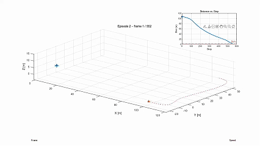
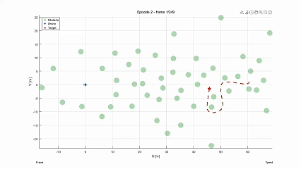

  
   
  <h1>PPF-framework: Dynamic-Target Potential Pursuit Field Reward for UAV Reinforcement Learning</h1>

Potential Pursuit Field (PPF),a novel reward shaping framework aimed to address the reward sparsity in reinforcement learning for dynamic target pursuit. By designing a droplet-shaped anisotropic potential field, the proposed PPF model provides dense and direction-aware reward signals while preserving policy invariance through potential-based reward shaping. Building upon PPF, we developed a hierarchical reinforcement learning algorithm, enabling target pursuit and obstacle avoidance in non-line-of-sight(NLOS) environments, simultaneously. 

## Demo
[🎬Bilibili](https://www.bilibili.com/video/BV1nDamziEjh)

[🎬 Watch demo (MP4)](./assets/video/gavideo.mp4)

## PPF-framework

  <table>
    <tr>
      <td></td>
    </tr>
    <tr>
      <td align="center">PPF-based framework</td>
    </tr>
  </table>

### A hierarchical reinforcement learning algorithm is proposed based on PPF, which can pursuit the NLOS target under obstacle environment.

## Potential Pursuit Field(PPF)

  
   
  <em>Art work of Potential Pursuit Field (PPF)</em>

### A novel concept of the Potential Pursuit Field (PPF) is proposed to support a continuous and dense reward-shaping function, which can capture anisotropic features and obtain richer gradient information than that of traditional rewards.

## Obstacle-free pursuit

  
  

## Obstacle pursuit

  
  

<em>Obstacle pursuit (left) and visualization (right)</em>

## This is the official for manuscript entitled Dynamic-Target Pursuit Potential Field Reward for UAV Reinforcement Learning submitted to IEEE Transactions on Control Systems Technology

The extire code and corresponding simulation environment will be released later.
